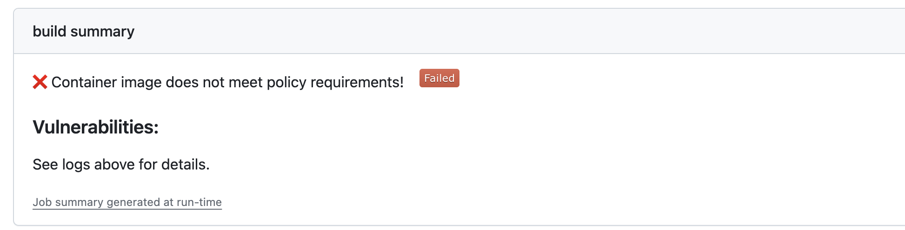

# GitHub Action for Vulnerability and Secrets Scanning with Wiz

This is a GitHub Action for invoking the Wiz scanner and returning the vulnerabilities and secrets found. By default, it fails if the container image does not meet policy requirements.

Use this in your workflows to quickly verify containers' content after a build and before pushing, allowing PRs, or deploying updates.

By default, a scan will produce very detailed output on system packages like an RPM or DEB, but also language-based packages. 

## Table of Contents
- [Authenticate to the Wiz API](#authenticate-to-the-wiz-api)
- [Usage](#usage)
  - [Failing a Build on Policy Requirements](#failing-a-build-on-policy-requirements)
  - [Generate Vulnerability and Secret scanning Reports](#generate-vulnerability-and-secret-scanning-reports)
  - [Using Wiz Action with GitHub Code Scanning](#using-wiz-action-with-github-code-scanning)
  - [Using Wiz Action Locally](#using-wiz-action-locally)
  - [Applying Role-based Access Control](#applying-role-based-access-control)
- [Action Inputs](#action-inputs)
- [Action Outputs](#action-outputs)

## Authenticate to the Wiz API
A **service account** key is required to authenticate to Wiz.

The service account must have the following:

* Account type: `Custom Integration (GraphQL API)`
* Permissions:
  * `create:security_scans`

Save the service account credentials as Github Secrets (`wiz_client_id` and `wiz_client_secret`):
* [Creating secrets for a repository.](https://docs.github.com/en/actions/security-guides/using-secrets-in-github-actions#creating-secrets-for-a-repository)
* [Creating secrets for an organization.](https://docs.github.com/en/actions/security-guides/using-secrets-in-github-actions#creating-secrets-for-an-organization)


## Usage

The simplest workflow for scanning a `localbuild/testimage` container:

```yaml
- name: Set up Docker Buildx
  uses: docker/setup-buildx-action@v2

- name: build local container
  uses: docker/build-push-action@v4
  with:
    tags: localbuild/testimage:latest
    push: false
    load: true

- name: Scan image
  uses: discoveryinc-infosec/<TO_DO>@v1
  with:
    container_image: "localbuild/testimage:latest"
    wiz_client_id: ${{ secrets.wiz_client_id }}
    wiz_client_secret: ${{ secrets.wiz_client_secret }}
```

### Failing a Build on Policy Requirements

If no policies are specified, Wiz CLI uses the default policies:

|     **Type**    	|                                            **Definition**                                            	|
|:---------------:	|:----------------------------------------------------------------------------------------------------:	|
| Vulnerabilities 	| Fail if one or more packages with `critical` severity vulnerabilities (CVEs) that have a fix are found|
| Secrets         	|                  Exposed secrets are only identified; there is no failure threshold                  	|

To use custom CI/CD policies instead of the default policies, set the `scan_policy` field to a comma-separated list of custom policies:

```yaml
- name: Scan image
  uses: discoveryinc-infosec/<TO_DO>@v1
  with:
    container_image: "localbuild/testimage:latest"
    wiz_client_id: ${{ secrets.wiz_client_id }}
    wiz_client_secret: ${{ secrets.wiz_client_secret }}
    scan_policy: "my-custom-policy-vuln,my-custom-policy-secrets"
```

Optionally, change the `action_exit_code` field to `0` to avoid failing the build regardless of policy requirements:

```yaml
- name: Scan image
  uses: discoveryinc-infosec/<TO_DO>@v1
  with:
    container_image: "localbuild/testimage:latest"
    wiz_client_id: ${{ secrets.wiz_client_id }}
    wiz_client_secret: ${{ secrets.wiz_client_secret }}
    action_exit_code: 0
```

### Generate Vulnerability and Secret Scanning Reports
The output of the scans can then be captured and organized into a structured security report. The results can be saved in a file and the report can be uploaded as an artifact.

Available options:
* `csv-zip:` example.zip
* `human:` example.txt or example
* `json:` example.json
* `sarif:` example.sarif
* `html:` example.html
* `xlsx:` example.xlsx

```yaml
- name: Scan image
  uses: discoveryinc-infosec/<TO_DO>@v1
  id: scan
  with:
    container_image: "localbuild/testimage:latest"
    wiz_client_id: ${{ secrets.wiz_client_id }}
    wiz_client_secret: ${{ secrets.wiz_client_secret }}
    report_name: "my-custom-report.html"

- name: Archive Report
    uses: actions/upload-artifact@v3
    with:
        name: wiz_vulnerabilities_secrets_report
        path: ${{ steps.scan.outputs.report_path }}
```

If you would like to upload the report even upon a non zero exit code from Wiz Scan, you can add the following to your upload step:

```yaml
- name: Scan image
  uses: discoveryinc-infosec/<TO_DO>@v1
  id: scan
  with:
    container_image: "localbuild/testimage:latest"
    wiz_client_id: ${{ secrets.wiz_client_id }}
    wiz_client_secret: ${{ secrets.wiz_client_secret }}
    report_name: "example.html"

- name: Archive Report
  uses: actions/upload-artifact@v3
  if: always() && steps.scan.outputs.report_path != ''
  with:
      name: wiz_vulnerabilities_secrets_report
      path: ${{ steps.scan.outputs.report_path }}
```

#### Where does the upload go?

At the bottom of the workflow summary page, there is a dedicated section for artifacts. Here's a screenshot of something you might see:


### Using Wiz Action with GitHub Code Scanning

If you have GitHub code scanning available you can use Wiz as a scanning tool as follows:

```yaml
- name: Scan image
  uses: discoveryinc-infosec/<TO_DO>@v1
  id: scan
  with:
    container_image: "localbuild/testimage:latest"
    wiz_client_id: ${{ secrets.wiz_client_id }}
    wiz_client_secret: ${{ secrets.wiz_client_secret }}
    report_name: "my-report.sarif"

- name: Upload Wiz scan results to GitHub Security tab
  uses: github/codeql-action/upload-sarif@v2
  with:
    sarif_file: ${{ steps.scan.outputs.report_path }}
```

If you would like to upload SARIF results to GitHub Code scanning even upon a non zero exit code from Wiz Scan, you can add the following to your upload step:

```yaml
- name: Scan image
  uses: discoveryinc-infosec/<TO_DO>@v1
  id: scan
  with:
    container_image: "localbuild/testimage:latest"
    wiz_client_id: ${{ secrets.wiz_client_id }}
    wiz_client_secret: ${{ secrets.wiz_client_secret }}
    report_name: "my-report.sarif"

- name: Upload Wiz scan results to GitHub Security tab
  uses: github/codeql-action/upload-sarif@v2
  if: always() && steps.scan.outputs.report_path != ''
  with:
    sarif_file: ${{ steps.scan.outputs.report_path }}
```

### Using Wiz Action Locally
This action can be used locally for scanning container images. Build the container locally and use the `--env-file` flag to configure the container.
```bash
docker build -t scan-container-image:1.0 .

cat action.env
INPUT_CONTAINER_IMAGE=alpine:latest
INPUT_WIZ_CLIENT_ID=<wiz_client_id>
INPUT_WIZ_CLIENT_SECRET=<wiz_client_secret>

docker run \
    --rm -it \
    --env-file action.env \
    --mount type=bind,src=/var/run/docker.sock,dst=/var/run/docker.sock,readonly \
    scan-container-image:1.0
```

If you want to create a report file, use the following:

```bash

cat action.env
INPUT_CONTAINER_IMAGE=alpine:latest
INPUT_WIZ_CLIENT_ID=<wiz_client_id>
INPUT_WIZ_CLIENT_SECRET=<wiz_client_secret>
INPUT_REPORT_NAME=my-custom-report.html

docker run \
    --rm -it \
    --env-file action.env \
    --mount type=bind,src=$PWD/output,dst=/action/output \
    --mount type=bind,src=/var/run/docker.sock,dst=/var/run/docker.sock,readonly \
    scan-container-image:1.0
```

Available variables:
* `INPUT_CONTAINER_IMAGE`
* `INPUT_WIZ_CLIENT_ID`
* `INPUT_WIZ_CLIENT_SECRET`
* `INPUT_ACTION_EXIT_CODE`
* `INPUT_REPORT_NAME`
* `INPUT_SCAN_FORMAT`
* `INPUT_SCAN_GROUP_BY`
* `INPUT_SCAN_POLICY`
* `INPUT_SCAN_POLICY_HITS_ONLY`
* `INPUT_SCAN_PROJECT`
* `INPUT_SCAN_SECRETS`
* `INPUT_SCAN_SHOW_SECRET_SNIPPETS`
* `INPUT_SCAN_SHOW_VULNERABILITY_DETAILS`
* `INPUT_SCAN_TAG`
* `INPUT_SCAN_TIMEOUT`
* `INPUT_SCAN_USED_DOCKERFILE`

### Applying Role-based Access Control

By default, Wiz CLI inherits the Project scoping of its service account. This means that users with Project-scoped roles can only see scan results for their own Projects. This can be overridden using the `scan_project` field.

```yaml
- name: Scan image
  uses: discoveryinc-infosec/<TO_DO>@v1
  with:
    container_image: "localbuild/testimage:latest"
    wiz_client_id: ${{ secrets.wiz_client_id }}
    wiz_client_secret: ${{ secrets.wiz_client_secret }}
    scan_project: "ACME"
```
> [!WARNING]  
> When using the `scan_project` field, the service account must be scoped to the specified Project(s).

## Action Inputs

The inputs `container_image`, `wiz_client_id`, and `wiz_client_secret` are **mandatory** keys; all the other keys are **optional**. These are all the available keys to configure this action:

|              **Name**             	| **Required?** 	| **Type** 	| **Description**                                                                                                            	|
|:---------------------------------:	|:-------------:	|----------	|----------------------------------------------------------------------------------------------------------------------------	|
| `container_image`                 	|      Yes      	| String   	| Image name, including the tag/digest, or path to file (`.tar`, `.tar.gz` or `.tgz`).                                       	|
| `wiz_client_id`                   	|      Yes      	| String   	| Wiz service account client ID.                                                                                             	|
| `wiz_client_secret`               	|       No      	| String   	| Wiz service account secret.                                                                                                	|
| `action_exit_code`                	|       No      	| Integer  	| Specify exit code when any security issues are found.                                                                      	|
| `report_name`                     	|       No      	| String   	| Save results to a report.                                                                                                  	|
| `scan_format`                     	|       No      	| Choice   	| Scan's output format. Available options are [`human`, `json`, `sarif`] (default "`human`").                                	|
| `scan_group_by`                   	|       No      	| Choice   	| Scan's output grouping field. Available options are [`default`, `layer`, `resource`] (default "`default`").                	|
| `scan_policy`                     	|       No      	| String   	| Scan policy to use. Can be passed multiple times to evaluate multiple policies. If not set, the default policies are used. 	|
| `scan_policy_hits_only`           	|       No      	| Boolean  	| Only display results that failed the applied policies.                                                                     	|
| `scan_project`                    	|       No      	| String   	| Scan's scoped project UUID. If project is omitted, default to service account's associated projects.                       	|
| `scan_secrets`                    	|       No      	| Boolean  	| Scan secrets (default `true`).                                                                                             	|
| `scan_show_secret_snippets`       	|       No      	| Boolean  	| Enable snippets in secrets.                                                                                                	|
| `scan_show_vulnerability_details` 	|       No      	| Boolean  	| Show vulnerability descriptions and CVSS metrics from the NVD database.                                                    	|
| `scan_tag`                        	|       No      	| String   	| Tags to mark the scan with, can be `KEY` or `KEY=VALUE` (default `[]`).                                                    	|
| `scan_timeout`                    	|       No      	| String   	| Operation timeout (default "`1h0m0s`").                                                                                    	|
| `scan_used_dockerfile`            	|       No      	| String   	| Dockerfile file used to build the image.                                                                                   	| 

## Action Outputs
After the scan is completed, this action will produce the scan results. The scan report (if option enabled) and short summary will be displayed in the GitHub step summary for easy visibility.

| Output Name       | Description         | Type   |
| ----------------- | ------------------- | ------ |
| `report_path`     | Report file path    | string |
| `wiz_scan_status` | Status report       | string |

### Sample Github Summary Report



